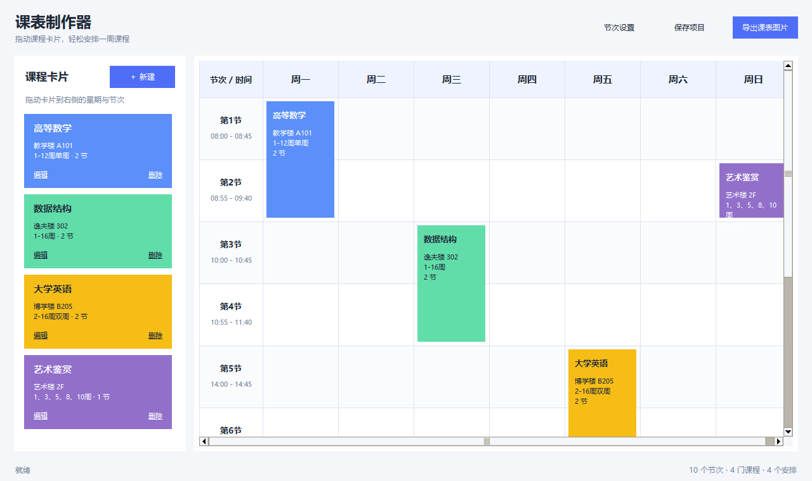

# 课表制作器 / Timetable Builder

课表制作器是一款中文 Windows 桌面程序，可通过创建课程卡片并拖拽到课表的方式，快速制作和维护大学课程表。程序采用原生桌面界面，无需浏览器或后端服务；项目数据保存在本地，完整课表可导出为高清 PNG。

## 核心功能

- 自定义节次名称、开始时间和结束时间，全周共用同一套节次
- 创建课程卡片并拖拽到“星期 + 节次”位置
- 已排课程可拖动换位、双击编辑或右键删除
- 支持 1-20 节的连堂课程
- 支持全部周次、指定范围、范围内单周/双周、自定义周次
- 自动分配区分度较高的课程颜色
- 通过颜色选择器手动修改颜色
- 冲突检测：节次和实际上课周次均重叠时提示，不覆盖原课程
- 使用 UTF-8 JSON 保存项目，重新启动后继续编辑
- 导出只含完整课表的 192 DPI 高清 PNG，默认保存到当前用户桌面
- 兼容中文项目路径和中文桌面路径

## 项目截图



> 上图由项目自身的 PNG 导出模块生成。运行程序后可看到包含课程侧栏、拖拽交互和节次设置的完整编辑界面。

## 安装方法

环境要求：Windows 10/11、Python 3.11 或更高版本（安装时需包含 Tcl/Tk）。

```powershell
cd D:\课表
python -m venv .venv
.\.venv\Scripts\python.exe -m pip install -r requirements.txt
```

也可以直接双击 `run.bat`；首次运行时会自动创建虚拟环境并安装依赖。

## 运行方法

```powershell
cd D:\课表
.\.venv\Scripts\python.exe main.py
```

快捷键：`Ctrl+S` 保存项目。

## 项目结构

```text
D:\课表\
├─ main.py                  # 程序入口
├─ timetable\
│  ├─ models.py             # 节次、课程、周次规则与课表数据模型
│  ├─ logic.py              # 排课、移动、冲突检测与配色逻辑
│  ├─ storage.py            # JSON 原子保存和恢复
│  ├─ exporter.py           # 高清 PNG 渲染和桌面路径解析
│  └─ ui.py                 # Tkinter 中文界面与拖拽交互
├─ tests\                   # 业务、存储、导出和 UI 集成测试
├─ data\                    # 本地项目数据（JSON 不提交到 Git）
├─ screenshots\            # README 截图
├─ tools\generate_preview.py # README 界面截图生成脚本
├─ resources\              # 预留资源目录
├─ requirements.txt
├─ run.bat
└─ README.md
```

## 使用教程

1. 点击“节次设置”，增加、编辑或删除节次，并填写 `HH:MM` 格式的时间。
2. 点击左侧“＋ 新建”，填写课程名称、地点、周次、持续节数和颜色。
3. 按住课程卡片，将它拖到右侧目标星期和节次后释放。连堂课程会自动占用连续节次。
4. 拖动课表中的课程可换位；双击可编辑课程；右键可编辑、改色或删除当前安排。
5. 点击“保存项目”将数据保存到 `data/timetable.json`。
6. 点击“导出课表图片”，只含课表的高清 PNG 将保存到 Windows 桌面，成功提示会显示完整路径。

## 测试

```powershell
.\.venv\Scripts\python.exe -m pytest -v
```

测试覆盖周次规则、单双周错峰、冲突提示、连堂边界、课程编辑回滚、删除、中文路径保存/恢复、PNG 导出和完整 UI 服务流程。

## 数据与隐私

程序不联网，不收集数据，不包含任何 Token 或密钥。用户课表 JSON 仅保存在本机，且已通过 `.gitignore` 排除在 Git 仓库之外。
